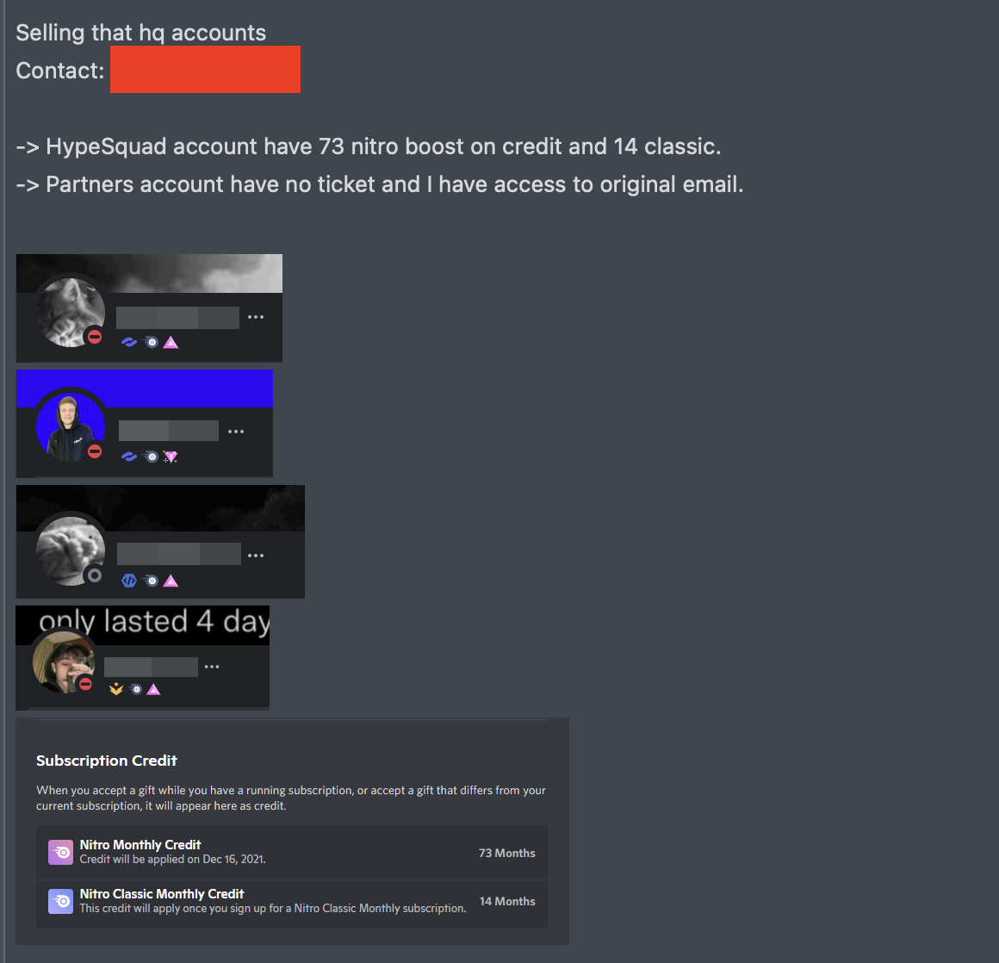
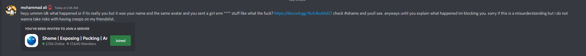

</img>

DMV (Discord Malware Variants) is a repository made to bring light to harmful programs used by bad actors in order to steal sensitive information from victims primarily over discord. Many methods of attacks will be displayed throughout this
document.

## 📚 Index

- [📚 Index](#index)
- [🧾 Known Stealers](stealers/STEALERS.md)
- [💬 Information](#info)
- [🛑 Popular scams](#scams)
- [✅ Reporting a scam](#report)
- [👓 Removal of malicious programs](#removal)
- [🤝 Trusted Servers](#guilds)
- [🔨 Contributors](#contributors)
- [🧩 Contributing](#contributing)

## 💬 Information
What is a "discord token"?

A token is string based on multiple properties of an account used by discord in order to authorize a specific user. This string however can be used as a key to directly access a discord users account where a malicious hacker may steal sensitive information such as emails, phone numbers, billing information, and more.

Due to this access, many malicious programs and methods have sprung up in order to automate the process of stealing. These programs are prevalent on GitHub and are also promoted through the use of "mass dming", whereby many botted discord accounts will directly message all users in a server to join their guild or run their program. These programs were also embedded into tools that users would run without knowing malware was inside

As these programs evolved, they became much more advanced, and were useful for more than just discord tokens. Some of these stealers developed password and cookie stealing from popular browsers, Crypto wallet stealers for popular crypto wallets like Exodus and Metamask.

Some common features of the more advanced grabbers are listed below:
- Discord token
- Discord password
- Discord email
- Badges
- Automatically purchase nitro for self
- Credit card info (number, expiry date, cvv)
- Internet IP
- Browser passwords and cookies (chromium usually)
- Cryptocurrency wallets (Exodus, Metamask, etc.)
- No antivirus detections on popular AV's (Windows Defender, etc.)

Stores attempting to sell logged accounts also popped up as seen below:

## 🛑 Popular scams
### Game tester scam
In the game tester scam, the scammer asks you to test a game for a school project, attaching a executable the victim will run. Victims may be eager to be a beta tester for a new game and will unknowingly run a malicious executable stealing their information.

[Reddit: The Recent "Try my game" Discord Scam: Explained](https://www.reddit.com/r/discordapp/comments/s1f1vs/the_recent_try_my_game_discord_scam_explained/)

### "You've been exposed in this server" scam
In this scam someone sends you a message along the lines of "You have been exposed join this discord". Upon joining a bot will ask you to scan a QR code for verification. This QR code however grant the owner of the code direct access to your account if scanned by the phone of the account holder. This is an exploit in the relatively recent update to discord allowing your logged in phone to grant any desktop instant access to your discord account through a QR code. There is a warning in the app to be careful though this hasn't been enough for some people. Obviously your photos have not been leaked and the ultimate goal of the scammer is to get access to your account. This method exploits the self-consciousness and fear of the victim and does not even require any outside program.

[Discord Name and Shame Scam Explained]("https://news.trendmicro.com/2022/07/08/discord-name-and-shame-scam-server-shaming/)

### QR Code - Free nitro scam
In a similar method to the former scam, the scammer sends you a QR code. Upon scanning the QR code, the scammer will receive your discord account information allowing them to log in. This works different in the sense that it attempts to look like a discord gift that can be redeemed for nitro when scanned.

## ✅ Reporting a scam

To report this scam go to [Submit a request](https://support.discord.com/hc/en-us/requests/new)
and fill out the forum

## 👓 Removal of malicious programs

### Removal of Discord injected malwares

If the scammer can still successfully access your discord account after you have removed the malware and changed your discord password, your discord process may be injected.

This malware can be removed by simply deleting discord and reinstalling. In order to do this you must:
1. Open your system tray, right click discord, and click quit
2. Press Win + R and type `%localappdata%`, then press OK
3. Proceed to look through this folder for a folder named `Discord`
4. Delete the `Discord` folder and ensure it is completely gone from this directory
5. Reinstall discord from the official discord website and change your password again

### Removal of sophisticated malwares

#### [Tron-Script](https://github.com/bmrf/tron/)
`Tron` is a powerful tool that is basically a lot of batch files that automates the process of disinfecting your windows machine

Here's a list of resources related to Tron

   
- [Download it here](https://www.reddit.com/r/TronScript/wiki/downloads)
- [The official Reddit page](https://old.reddit.com/r/TronScript/wiki/index)
- [Github for source code](https://github.com/bmrf/tron)
- Tron-Script seems to be using Reddit as their main page

#### [Process Hacker](https://processhacker.sourceforge.io/)
`Process Hacker` is like an advanced task manager it will help you find paranormal activties and terminate and suspend them

Here's a list of resources related to Process Hacker 

- [Download it here](https://processhacker.sourceforge.io/nightly.php)
- [The official page](https://processhacker.sourceforge.io/)
- [Github for source code](https://github.com/winsiderss/systeminformer)
- Sadly I could not find a reddit page dedicated to Process Hacker

## 🤝 Trusted Servers
- [Scam Recovery Centre](https://discord.gg/T7xmU3hTmG) → Discord scam awareness
## 🔨 Contributors

- Addi
   - [Website](https://www.addidix.xyz)
   - [Email](mailto:addidix@proton.me)
   - [Discord](https://paste.addi00000.repl.co/?p=notaddidix%231400)
- mmmly
   - [Website](https://morimolymoly.com/)
   - [Email](mailto:morimolymoly@gmail.com)

## 🧩 Contributing
- Fork, edit, and make a pull request.
- Make sure to make a useful commit message and description on the pull request.
- Use existing data as a guide for your addition and follow the patterns if applicable.
- Also contact me if you are up for reverse engineering the file stub/virus.
</img>
